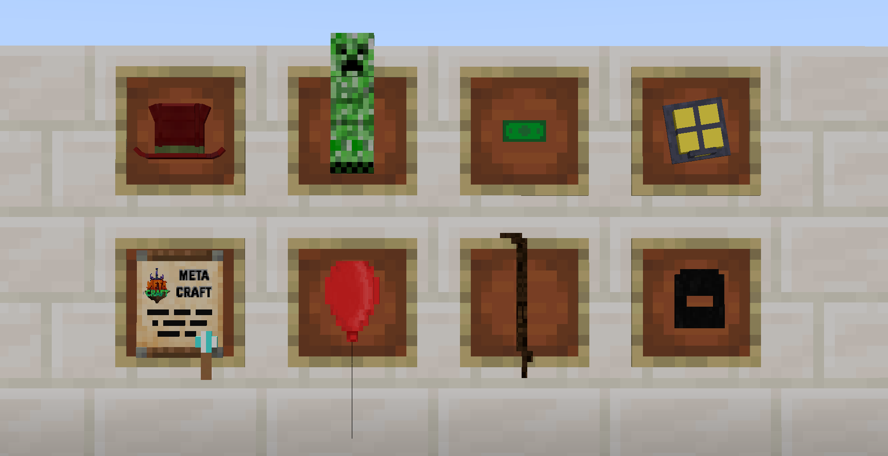

# MetaCraft RolePlay Resource Pack

This repository contains a custom resource pack for MetaCraft RolePlays, designed to enhance the Minecraft experience on the MetaCraft server.

## Installation

1. **Download the Resource Pack**:
   - Clone the repository or download the ZIP file from the [GitHub page](https://github.com/metacraftsmp/resource-pack).

2. **Move to Resource Packs Folder**:
   - Place the downloaded resource pack into your Minecraft `resourcepacks` directory. This can typically be found at:
     ```
     C:\Users\[Your Username]\AppData\Roaming\.minecraft\resourcepacks
     ```
     on Windows, or `~/Library/Application Support/minecraft/resourcepacks` on macOS.

3. **Enable in Game**:
   - Launch Minecraft.
   - Go to `Options` > `Resource Packs`.
   - Select and enable the MetaCraft resource pack.

4. **Custom Roleplay Data**:
   - Download and place the custom roleplay data pack into your world's `datapacks` folder. You can find it [here](https://github.com/MukiTanuki/custom_roleplay_data).

## Usage on MetaCraft Server

This resource pack is force-loaded on the MetaCraft server to ensure all players have a consistent and enhanced visual experience. When you join the server, the resource pack will automatically be applied.

## Custom Skins

### Public Skins



The resource pack adds custom skins to various items. These skins can be accessed using the following commands:

- **Item:** `carved_pumpkin`
  - `/trigger CustomModelData set 1`: Big Hat
  - `/trigger CustomModelData set 2`: Creeper Costume
  - `/trigger CustomModelData set 3`: Money Cash
  - `/trigger CustomModelData set 4`: Miner Hat
  - `/trigger CustomModelData set 5`: MetaCraft Document
  - `/trigger CustomModelData set 6`: Balloon
  - `/trigger CustomModelData set 7`: Walking Stick
  - `/trigger CustomModelData set 8`: Mask

### Roleplay-Specific Skins

Certain custom skins are exclusive to specific roleplay players and can only be used by them:

- **User:** `fercius`
  - **Item:** `carved_pumpkin`
    - `/trigger CustomModelData set 120001`: Winner Cup
    - `/trigger CustomModelData set 120002`: Mic
    - `/trigger CustomModelData set 120003`: Camera

- **User:** `wikiweb`
  - **Item:** `bow`
    - `/trigger CustomModelData set 600001`: Winchester Gun

## Contributing

We welcome contributions to improve and expand the resource pack. To contribute:

1. Fork the repository.
2. Create a new branch for your changes.
3. Commit your changes and push them to your forked repository.
4. Create a pull request with a detailed description of your changes.

Players can clone the project and design their own skins, then submit a pull request for inclusion.

## Issues

If you encounter any issues or have suggestions for improvements, please open an issue in the [GitHub repository](https://github.com/metacraftsmp/resource-pack/issues).

## License

This project is licensed under the MIT License. See the [LICENSE](LICENSE) file for details.
